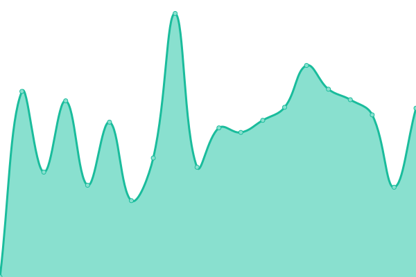

# [📈 Live Status](https://utm.striketing.com): <!--live status--> **🟧 Partial outage**

This repository contains the open-source uptime monitor and status page for [Striketing](https://utm.striketing.com), powered by [Upptime](https://github.com/upptime/upptime).

With [Upptime](https://upptime.js.org), you can get your own unlimited and free uptime monitor and status page, powered entirely by a GitHub repository. We use [Issues](https://github.com/Striketing/STR-UTM/issues) as incident reports, [Actions](https://github.com/Striketing/STR-UTM/actions) as uptime monitors, and [Pages](https://utm.striketing.com) for the status page.

<!--start: status pages-->
<!-- This summary is generated by Upptime (https://github.com/upptime/upptime) -->
<!-- Do not edit this manually, your changes will be overwritten -->
<!-- prettier-ignore -->
| URL | Status | History | Response Time | Uptime |
| --- | ------ | ------- | ------------- | ------ |
|  [aggsrl.com](https://www.aggsrl.com) | 🟩 Up | [aggsrl-com.yml](https://github.com/Striketing/STR-UTM/commits/HEAD/history/aggsrl-com.yml) | 

 842ms
     
 | 

<a href="https://utm.striketing.com/history/aggsrl-com">93.50%</a>
    

|  [amburgheria.it](https://www.amburgheria.it) | 🟩 Up | [amburgheria-it.yml](https://github.com/Striketing/STR-UTM/commits/HEAD/history/amburgheria-it.yml) | 

 2432ms
     
 | 

<a href="https://utm.striketing.com/history/amburgheria-it">93.56%</a>
    

|  [andreaus.com](https://www.andreaus.com) | 🟩 Up | [andreaus-com.yml](https://github.com/Striketing/STR-UTM/commits/HEAD/history/andreaus-com.yml) | 

 2214ms
     
 | 

<a href="https://utm.striketing.com/history/andreaus-com">93.63%</a>
    

|  [anomalje.com](https://www.anomalje.com) | 🟩 Up | [anomalje-com.yml](https://github.com/Striketing/STR-UTM/commits/HEAD/history/anomalje-com.yml) | 

 2329ms
     
 | 

<a href="https://utm.striketing.com/history/anomalje-com">93.69%</a>
    

|  [aqualta.it](https://www.aqualta.it) | 🟩 Up | [aqualta-it.yml](https://github.com/Striketing/STR-UTM/commits/HEAD/history/aqualta-it.yml) | 

 2297ms
     
 | 

<a href="https://utm.striketing.com/history/aqualta-it">93.76%</a>
    

|  [aqualtra.it](https://www.aqualtra.it) | 🟩 Up | [aqualtra-it.yml](https://github.com/Striketing/STR-UTM/commits/HEAD/history/aqualtra-it.yml) | 

 2530ms
     
 | 

<a href="https://utm.striketing.com/history/aqualtra-it">93.83%</a>
    

|  [benifin.it](https://www.benifin.it) | 🟩 Up | [benifin-it.yml](https://github.com/Striketing/STR-UTM/commits/HEAD/history/benifin-it.yml) | 

 2553ms
     
 | 

<a href="https://utm.striketing.com/history/benifin-it">93.89%</a>
    

|  [blastism.com](https://www.blastism.com) | 🟥 Down | [blastism-com.yml](https://github.com/Striketing/STR-UTM/commits/HEAD/history/blastism-com.yml) | 

 1323ms
     
 | 

<a href="https://utm.striketing.com/history/blastism-com">0.00%</a>
    

|  [canalgrande.it](https://www.canalgrande.it) | 🟩 Up | [canalgrande-it.yml](https://github.com/Striketing/STR-UTM/commits/HEAD/history/canalgrande-it.yml) | 

 1488ms
     
 | 

<a href="https://utm.striketing.com/history/canalgrande-it">94.03%</a>
    

|  [carfilmdigitale.it](https://www.carfilmdigitale.it) | 🟩 Up | [carfilmdigitale-it.yml](https://github.com/Striketing/STR-UTM/commits/HEAD/history/carfilmdigitale-it.yml) | 

 3592ms
     
 | 

<a href="https://utm.striketing.com/history/carfilmdigitale-it">94.10%</a>
    

|  [cessionedelquinto-online.it](https://www.cessionedelquinto-online.it) | 🟩 Up | [cessionedelquinto-online-it.yml](https://github.com/Striketing/STR-UTM/commits/HEAD/history/cessionedelquinto-online-it.yml) | 

 2377ms
     
 | 

<a href="https://utm.striketing.com/history/cessionedelquinto-online-it">94.16%</a>
    

|  [cessionedelquintopensionati.com](https://www.cessionedelquintopensionati.com) | 🟩 Up | [cessionedelquintopensionati-com.yml](https://github.com/Striketing/STR-UTM/commits/HEAD/history/cessionedelquintopensionati-com.yml) | 

 968ms
     
 | 

<a href="https://utm.striketing.com/history/cessionedelquintopensionati-com">94.23%</a>
    

|  [clarity-app.com](https://www.clarity-app.com) | 🟩 Up | [clarity-app-com.yml](https://github.com/Striketing/STR-UTM/commits/HEAD/history/clarity-app-com.yml) | 

 1652ms
     
 | 

<a href="https://utm.striketing.com/history/clarity-app-com">94.30%</a>
    

|  [clinicatodaro.it](https://www.clinicatodaro.it) | 🟥 Down | [clinicatodaro-it.yml](https://github.com/Striketing/STR-UTM/commits/HEAD/history/clinicatodaro-it.yml) | 

 0ms
     
 | 

<a href="https://utm.striketing.com/history/clinicatodaro-it">100.00%</a>
    

|  [cobret.us](https://www.cobret.us) | 🟩 Up | [cobret-us.yml](https://github.com/Striketing/STR-UTM/commits/HEAD/history/cobret-us.yml) | 

 2349ms
     
 | 

<a href="https://utm.striketing.com/history/cobret-us">94.37%</a>
    

|  [corsosaldatura.com](https://www.corsosaldatura.com) | 🟩 Up | [corsosaldatura-com.yml](https://github.com/Striketing/STR-UTM/commits/HEAD/history/corsosaldatura-com.yml) | 

 1421ms
     
 | 

<a href="https://utm.striketing.com/history/corsosaldatura-com">94.44%</a>
    

|  [coverall-italia.com](https://www.coverall-italia.com) | 🟩 Up | [coverall-italia-com.yml](https://github.com/Striketing/STR-UTM/commits/HEAD/history/coverall-italia-com.yml) | 

 866ms
     
 | 

<a href="https://utm.striketing.com/history/coverall-italia-com">94.51%</a>
    

|  [distilleriagastaldi.com](https://www.distilleriagastaldi.com) | 🟩 Up | [distilleriagastaldi-com.yml](https://github.com/Striketing/STR-UTM/commits/HEAD/history/distilleriagastaldi-com.yml) | 

 2239ms
     
 | 

<a href="https://utm.striketing.com/history/distilleriagastaldi-com">94.57%</a>
    

|  [eco-innovazione.it](https://www.eco-innovazione.it) | 🟩 Up | [eco-innovazione-it.yml](https://github.com/Striketing/STR-UTM/commits/HEAD/history/eco-innovazione-it.yml) | 

 2845ms
     
 | 

<a href="https://utm.striketing.com/history/eco-innovazione-it">94.64%</a>
    

|  [energiasolaresemplice.com](https://www.energiasolaresemplice.com) | 🟩 Up | [energiasolaresemplice-com.yml](https://github.com/Striketing/STR-UTM/commits/HEAD/history/energiasolaresemplice-com.yml) | 

 2139ms
     
 | 

<a href="https://utm.striketing.com/history/energiasolaresemplice-com">94.70%</a>
    

|  [escoconsulting.it](https://www.escoconsulting.it) | 🟥 Down | [escoconsulting-it.yml](https://github.com/Striketing/STR-UTM/commits/HEAD/history/escoconsulting-it.yml) | 

 0ms
     
 | 

<a href="https://utm.striketing.com/history/escoconsulting-it">100.00%</a>
    

|  [facciatesolari.net](https://www.facciatesolari.net) | 🟩 Up | [facciatesolari-net.yml](https://github.com/Striketing/STR-UTM/commits/HEAD/history/facciatesolari-net.yml) | 

 2391ms
     
 | 

<a href="https://utm.striketing.com/history/facciatesolari-net">94.77%</a>
    

|  [fedehaus.com](https://www.fedehaus.com) | 🟩 Up | [fedehaus-com.yml](https://github.com/Striketing/STR-UTM/commits/HEAD/history/fedehaus-com.yml) | 

 2682ms
     
 | 

<a href="https://utm.striketing.com/history/fedehaus-com">94.83%</a>
    

|  [geofondazioni.it](https://www.geofondazioni.it) | 🟩 Up | [geofondazioni-it.yml](https://github.com/Striketing/STR-UTM/commits/HEAD/history/geofondazioni-it.yml) | 

 1864ms
     
 | 

<a href="https://utm.striketing.com/history/geofondazioni-it">94.90%</a>
    

|  [gianlucaviani.com](https://www.gianlucaviani.com) | 🟩 Up | [gianlucaviani-com.yml](https://github.com/Striketing/STR-UTM/commits/HEAD/history/gianlucaviani-com.yml) | 

 1832ms
     
 | 

<a href="https://utm.striketing.com/history/gianlucaviani-com">94.97%</a>
    

|  [giuliazanattadesign.com](https://www.giuliazanattadesign.com) | 🟩 Up | [giuliazanattadesign-com.yml](https://github.com/Striketing/STR-UTM/commits/HEAD/history/giuliazanattadesign-com.yml) | 

 2495ms
     
 | 

<a href="https://utm.striketing.com/history/giuliazanattadesign-com">95.03%</a>
    

|  [inoxibiza.com](https://www.inoxibiza.com) | 🟥 Down | [inoxibiza-com.yml](https://github.com/Striketing/STR-UTM/commits/HEAD/history/inoxibiza-com.yml) | 

 0ms
     
 | 

<a href="https://utm.striketing.com/history/inoxibiza-com">100.00%</a>
    

|  [isolcore.com](https://www.isolcore.com) | 🟩 Up | [isolcore-com.yml](https://github.com/Striketing/STR-UTM/commits/HEAD/history/isolcore-com.yml) | 

 1565ms
     
 | 

<a href="https://utm.striketing.com/history/isolcore-com">95.10%</a>
    

|  [isolcore.de](https://www.isolcore.de) | 🟩 Up | [isolcore-de.yml](https://github.com/Striketing/STR-UTM/commits/HEAD/history/isolcore-de.yml) | 

 2078ms
     
 | 

<a href="https://utm.striketing.com/history/isolcore-de">95.17%</a>
    

|  [isolcore.es](https://www.isolcore.es) | 🟩 Up | [isolcore-es.yml](https://github.com/Striketing/STR-UTM/commits/HEAD/history/isolcore-es.yml) | 

 2379ms
     
 | 

<a href="https://utm.striketing.com/history/isolcore-es">95.24%</a>
    

|  [isolcore.fr](https://www.isolcore.fr) | 🟩 Up | [isolcore-fr.yml](https://github.com/Striketing/STR-UTM/commits/HEAD/history/isolcore-fr.yml) | 

 1839ms
     
 | 

<a href="https://utm.striketing.com/history/isolcore-fr">95.30%</a>
    

|  [isolcore.uk](https://www.isolcore.uk) | 🟩 Up | [isolcore-uk.yml](https://github.com/Striketing/STR-UTM/commits/HEAD/history/isolcore-uk.yml) | 

 1953ms
     
 | 

<a href="https://utm.striketing.com/history/isolcore-uk">95.37%</a>
    

|  [itaforma.com](https://www.itaforma.com) | 🟩 Up | [itaforma-com.yml](https://github.com/Striketing/STR-UTM/commits/HEAD/history/itaforma-com.yml) | 

 2444ms
     
 | 

<a href="https://utm.striketing.com/history/itaforma-com">95.44%</a>
    

|  [ital-ina.it](https://www.ital-ina.it) | 🟥 Down | [ital-ina-it.yml](https://github.com/Striketing/STR-UTM/commits/HEAD/history/ital-ina-it.yml) | 

 0ms
     
 | 

<a href="https://utm.striketing.com/history/ital-ina-it">100.00%</a>
    

|  [jeffeveline.com](https://www.jeffeveline.com) | 🟩 Up | [jeffeveline-com.yml](https://github.com/Striketing/STR-UTM/commits/HEAD/history/jeffeveline-com.yml) | 

 2305ms
     
 | 

<a href="https://utm.striketing.com/history/jeffeveline-com">95.58%</a>
    

|  [josefingarage.com](https://www.josefingarage.com) | 🟩 Up | [josefingarage-com.yml](https://github.com/Striketing/STR-UTM/commits/HEAD/history/josefingarage-com.yml) | 

 1611ms
     
 | 

<a href="https://utm.striketing.com/history/josefingarage-com">95.64%</a>
    

|  [lanfree.net](https://www.lanfree.net) | 🟩 Up | [lanfree-net.yml](https://github.com/Striketing/STR-UTM/commits/HEAD/history/lanfree-net.yml) | 

 2045ms
     
 | 

<a href="https://utm.striketing.com/history/lanfree-net">95.86%</a>
    

|  [lucagaraboni.com](https://www.lucagaraboni.com) | 🟩 Up | [lucagaraboni-com.yml](https://github.com/Striketing/STR-UTM/commits/HEAD/history/lucagaraboni-com.yml) | 

 1679ms
     
 | 

<a href="https://utm.striketing.com/history/lucagaraboni-com">96.07%</a>
    

|  [marcoconte.net](https://www.marcoconte.net) | 🟩 Up | [marcoconte-net.yml](https://github.com/Striketing/STR-UTM/commits/HEAD/history/marcoconte-net.yml) | 

 1647ms
     
 | 

<a href="https://utm.striketing.com/history/marcoconte-net">96.13%</a>
    

|  [marinascafoclub.com](https://www.marinascafoclub.com) | 🟩 Up | [marinascafoclub-com.yml](https://github.com/Striketing/STR-UTM/commits/HEAD/history/marinascafoclub-com.yml) | 

 1947ms
     
 | 

<a href="https://utm.striketing.com/history/marinascafoclub-com">96.19%</a>
    

|  [momysweethome.com](https://www.momysweethome.com) | 🟩 Up | [momysweethome-com.yml](https://github.com/Striketing/STR-UTM/commits/HEAD/history/momysweethome-com.yml) | 

 257ms
     
 | 

<a href="https://utm.striketing.com/history/momysweethome-com">100.00%</a>
    

|  [my.marinascafoclub.com](https://www.my.marinascafoclub.com) | 🟩 Up | [my-marinascafoclub-com.yml](https://github.com/Striketing/STR-UTM/commits/HEAD/history/my-marinascafoclub-com.yml) | 

 2761ms
     
 | 

<a href="https://utm.striketing.com/history/my-marinascafoclub-com">96.39%</a>
    

|  [noleggiobarcavenezia.it](https://www.noleggiobarcavenezia.it) | 🟩 Up | [noleggiobarcavenezia-it.yml](https://github.com/Striketing/STR-UTM/commits/HEAD/history/noleggiobarcavenezia-it.yml) | 

 3231ms
     
 | 

<a href="https://utm.striketing.com/history/noleggiobarcavenezia-it">96.44%</a>
    

|  [nutrizionista-benessere.it](https://www.nutrizionista-benessere.it) | 🟩 Up | [nutrizionista-benessere-it.yml](https://github.com/Striketing/STR-UTM/commits/HEAD/history/nutrizionista-benessere-it.yml) | 

 3048ms
     
 | 

<a href="https://utm.striketing.com/history/nutrizionista-benessere-it">96.49%</a>
    

|  [prestiti-inpdap.com](https://www.prestiti-inpdap.com) | 🟩 Up | [prestiti-inpdap-com.yml](https://github.com/Striketing/STR-UTM/commits/HEAD/history/prestiti-inpdap-com.yml) | 

 1793ms
     
 | 

<a href="https://utm.striketing.com/history/prestiti-inpdap-com">96.55%</a>
    

|  [prestito-personale.com](https://www.prestito-personale.com) | 🟩 Up | [prestito-personale-com.yml](https://github.com/Striketing/STR-UTM/commits/HEAD/history/prestito-personale-com.yml) | 

 2775ms
     
 | 

<a href="https://utm.striketing.com/history/prestito-personale-com">96.60%</a>
    

|  [prestitonet.com](https://www.prestitonet.com) | 🟩 Up | [prestitonet-com.yml](https://github.com/Striketing/STR-UTM/commits/HEAD/history/prestitonet-com.yml) | 

 1794ms
     
 | 

<a href="https://utm.striketing.com/history/prestitonet-com">96.80%</a>
    

|  [shop.defaverispumanti.it](https://shop.defaverispumanti.it) | 🟩 Up | [shop-defaverispumanti-it.yml](https://github.com/Striketing/STR-UTM/commits/HEAD/history/shop-defaverispumanti-it.yml) | 

 6439ms
     
 | 

<a href="https://utm.striketing.com/history/shop-defaverispumanti-it">96.84%</a>
    

|  [striketing.com](https://www.striketing.com) | 🟩 Up | [striketing-com.yml](https://github.com/Striketing/STR-UTM/commits/HEAD/history/striketing-com.yml) | 

 2789ms
     
 | 

<a href="https://utm.striketing.com/history/striketing-com">97.03%</a>
    

|  [techno-vip.it](https://www.techno-vip.it) | 🟩 Up | [techno-vip-it.yml](https://github.com/Striketing/STR-UTM/commits/HEAD/history/techno-vip-it.yml) | 

 736ms
     
 | 

<a href="https://utm.striketing.com/history/techno-vip-it">100.00%</a>
    

|  [tessilmoquette.it](https://www.tessilmoquette.it) | 🟩 Up | [tessilmoquette-it.yml](https://github.com/Striketing/STR-UTM/commits/HEAD/history/tessilmoquette-it.yml) | 

 3275ms
     
 | 

<a href="https://utm.striketing.com/history/tessilmoquette-it">97.08%</a>
    

|  [ubm1948.com](https://www.ubm1948.com) | 🟩 Up | [ubm1948-com.yml](https://github.com/Striketing/STR-UTM/commits/HEAD/history/ubm1948-com.yml) | 

 1470ms
     
 | 

<a href="https://utm.striketing.com/history/ubm1948-com">97.27%</a>
    

|  [vincenzoprimitivo.com](https://www.vincenzoprimitivo.com) | 🟩 Up | [vincenzoprimitivo-com.yml](https://github.com/Striketing/STR-UTM/commits/HEAD/history/vincenzoprimitivo-com.yml) | 

 2299ms
     
 | 

<a href="https://utm.striketing.com/history/vincenzoprimitivo-com">97.46%</a>
    

|  [vobrecords.com](https://www.vobrecords.com) | 🟩 Up | [vobrecords-com.yml](https://github.com/Striketing/STR-UTM/commits/HEAD/history/vobrecords-com.yml) | 

 872ms
     
 | 

<a href="https://utm.striketing.com/history/vobrecords-com">97.64%</a>
    

|  [wrapboyz.it](https://www.wrapboyz.it) | 🟩 Up | [wrapboyz-it.yml](https://github.com/Striketing/STR-UTM/commits/HEAD/history/wrapboyz-it.yml) | 

 4336ms
     
 | 

<a href="https://utm.striketing.com/history/wrapboyz-it">97.67%</a>
    

|  [wspring.club](https://www.wspring.club) | 🟩 Up | [wspring-club.yml](https://github.com/Striketing/STR-UTM/commits/HEAD/history/wspring-club.yml) | 

 2565ms
     
 | 

<a href="https://utm.striketing.com/history/wspring-club">97.70%</a>
    

|  [zelandidesign.com](https://www.zelandidesign.com) | 🟩 Up | [zelandidesign-com.yml](https://github.com/Striketing/STR-UTM/commits/HEAD/history/zelandidesign-com.yml) | 

 3522ms
     
 | 

<a href="https://utm.striketing.com/history/zelandidesign-com">97.73%</a>
    

<!--end: status pages-->

[**Visit our status website →**](https://utm.striketing.com)

## 📄 License

- Powered by: [Upptime](https://github.com/upptime/upptime)
- Code: [MIT](./LICENSE) © [Anand Chowdhary](https://anandchowdhary.com), supported by [Pabio](https://pabio.com)
- Data in the `./history` directory: [Open Database License](https://opendatacommons.org/licenses/odbl/1-0/)
