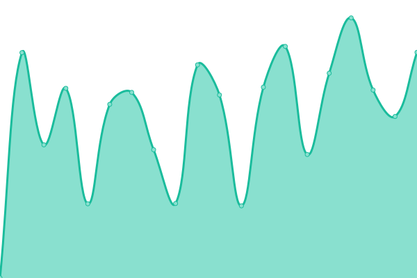
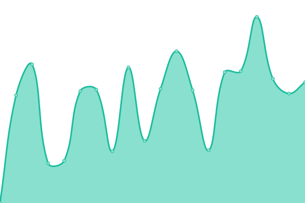

# [📈 Live Status](https://utm.striketing.com): <!--live status--> **🟧 Partial outage**

This repository contains the open-source uptime monitor and status page for [Striketing](https://utm.striketing.com), powered by [Upptime](https://github.com/upptime/upptime).

With [Upptime](https://upptime.js.org), you can get your own unlimited and free uptime monitor and status page, powered entirely by a GitHub repository. We use [Issues](https://github.com/Striketing/STR-UTM/issues) as incident reports, [Actions](https://github.com/Striketing/STR-UTM/actions) as uptime monitors, and [Pages](https://utm.striketing.com) for the status page.

<!--start: status pages-->
<!-- This summary is generated by Upptime (https://github.com/upptime/upptime) -->
<!-- Do not edit this manually, your changes will be overwritten -->
<!-- prettier-ignore -->
| URL | Status | History | Response Time | Uptime |
| --- | ------ | ------- | ------------- | ------ |
|  [aggsrl.com](https://www.aggsrl.com) | 🟥 Down | [aggsrl-com.yml](https://github.com/Striketing/STR-UTM/commits/HEAD/history/aggsrl-com.yml) | 

 913ms
     
 | 

<a href="https://utm.striketing.com/history/aggsrl-com">93.64%</a>
    

|  [amburgheria.it](https://www.amburgheria.it) | 🟥 Down | [amburgheria-it.yml](https://github.com/Striketing/STR-UTM/commits/HEAD/history/amburgheria-it.yml) | 

 2301ms
     
 | 

<a href="https://utm.striketing.com/history/amburgheria-it">93.72%</a>
    

|  [andreaus.com](https://www.andreaus.com) | 🟥 Down | [andreaus-com.yml](https://github.com/Striketing/STR-UTM/commits/HEAD/history/andreaus-com.yml) | 

 3099ms
     
 | 

<a href="https://utm.striketing.com/history/andreaus-com">93.79%</a>
    

|  [anomalje.com](https://www.anomalje.com) | 🟥 Down | [anomalje-com.yml](https://github.com/Striketing/STR-UTM/commits/HEAD/history/anomalje-com.yml) | 

 2629ms
     
 | 

<a href="https://utm.striketing.com/history/anomalje-com">93.85%</a>
    

|  [aqualta.it](https://www.aqualta.it) | 🟥 Down | [aqualta-it.yml](https://github.com/Striketing/STR-UTM/commits/HEAD/history/aqualta-it.yml) | 

 2375ms
     
 | 

<a href="https://utm.striketing.com/history/aqualta-it">93.74%</a>
    

|  [aqualtra.it](https://www.aqualtra.it) | 🟥 Down | [aqualtra-it.yml](https://github.com/Striketing/STR-UTM/commits/HEAD/history/aqualtra-it.yml) | 

 2129ms
     
 | 

<a href="https://utm.striketing.com/history/aqualtra-it">94.00%</a>
    

|  [benifin.it](https://www.benifin.it) | 🟥 Down | [benifin-it.yml](https://github.com/Striketing/STR-UTM/commits/HEAD/history/benifin-it.yml) | 

 3075ms
     
 | 

<a href="https://utm.striketing.com/history/benifin-it">94.07%</a>
    

|  [blastism.com](https://www.blastism.com) | 🟥 Down | [blastism-com.yml](https://github.com/Striketing/STR-UTM/commits/HEAD/history/blastism-com.yml) | 

 1219ms
     
 | 

<a href="https://utm.striketing.com/history/blastism-com">0.00%</a>
    

|  [canalgrande.it](https://www.canalgrande.it) | 🟥 Down | [canalgrande-it.yml](https://github.com/Striketing/STR-UTM/commits/HEAD/history/canalgrande-it.yml) | 

 1610ms
     
 | 

<a href="https://utm.striketing.com/history/canalgrande-it">94.21%</a>
    

|  [carfilmdigitale.it](https://www.carfilmdigitale.it) | 🟥 Down | [carfilmdigitale-it.yml](https://github.com/Striketing/STR-UTM/commits/HEAD/history/carfilmdigitale-it.yml) | 

 2428ms
     
 | 

<a href="https://utm.striketing.com/history/carfilmdigitale-it">94.28%</a>
    

|  [cessionedelquinto-online.it](https://www.cessionedelquinto-online.it) | 🟥 Down | [cessionedelquinto-online-it.yml](https://github.com/Striketing/STR-UTM/commits/HEAD/history/cessionedelquinto-online-it.yml) | 

 1996ms
     
 | 

<a href="https://utm.striketing.com/history/cessionedelquinto-online-it">94.36%</a>
    

|  [cessionedelquintopensionati.com](https://www.cessionedelquintopensionati.com) | 🟥 Down | [cessionedelquintopensionati-com.yml](https://github.com/Striketing/STR-UTM/commits/HEAD/history/cessionedelquintopensionati-com.yml) | 

 995ms
     
 | 

<a href="https://utm.striketing.com/history/cessionedelquintopensionati-com">94.43%</a>
    

|  [clarity-app.com](https://www.clarity-app.com) | 🟥 Down | [clarity-app-com.yml](https://github.com/Striketing/STR-UTM/commits/HEAD/history/clarity-app-com.yml) | 

 1680ms
     
 | 

<a href="https://utm.striketing.com/history/clarity-app-com">94.50%</a>
    

|  [clinicatodaro.it](https://www.clinicatodaro.it) | 🟥 Down | [clinicatodaro-it.yml](https://github.com/Striketing/STR-UTM/commits/HEAD/history/clinicatodaro-it.yml) | 

 0ms
     
 | 

<a href="https://utm.striketing.com/history/clinicatodaro-it">100.00%</a>
    

|  [cobret.us](https://www.cobret.us) | 🟥 Down | [cobret-us.yml](https://github.com/Striketing/STR-UTM/commits/HEAD/history/cobret-us.yml) | 

 1992ms
     
 | 

<a href="https://utm.striketing.com/history/cobret-us">94.57%</a>
    

|  [corsosaldatura.com](https://www.corsosaldatura.com) | 🟥 Down | [corsosaldatura-com.yml](https://github.com/Striketing/STR-UTM/commits/HEAD/history/corsosaldatura-com.yml) | 

 1548ms
     
 | 

<a href="https://utm.striketing.com/history/corsosaldatura-com">94.65%</a>
    

|  [coverall-italia.com](https://www.coverall-italia.com) | 🟥 Down | [coverall-italia-com.yml](https://github.com/Striketing/STR-UTM/commits/HEAD/history/coverall-italia-com.yml) | 

 845ms
     
 | 

<a href="https://utm.striketing.com/history/coverall-italia-com">94.72%</a>
    

|  [distilleriagastaldi.com](https://www.distilleriagastaldi.com) | 🟥 Down | [distilleriagastaldi-com.yml](https://github.com/Striketing/STR-UTM/commits/HEAD/history/distilleriagastaldi-com.yml) | 

 2341ms
     
 | 

<a href="https://utm.striketing.com/history/distilleriagastaldi-com">94.79%</a>
    

|  [eco-innovazione.it](https://www.eco-innovazione.it) | 🟥 Down | [eco-innovazione-it.yml](https://github.com/Striketing/STR-UTM/commits/HEAD/history/eco-innovazione-it.yml) | 

 2507ms
     
 | 

<a href="https://utm.striketing.com/history/eco-innovazione-it">94.86%</a>
    

|  [energiasolaresemplice.com](https://www.energiasolaresemplice.com) | 🟥 Down | [energiasolaresemplice-com.yml](https://github.com/Striketing/STR-UTM/commits/HEAD/history/energiasolaresemplice-com.yml) | 

 2372ms
     
 | 

<a href="https://utm.striketing.com/history/energiasolaresemplice-com">94.93%</a>
    

|  [escoconsulting.it](https://www.escoconsulting.it) | 🟥 Down | [escoconsulting-it.yml](https://github.com/Striketing/STR-UTM/commits/HEAD/history/escoconsulting-it.yml) | 

 0ms
     
 | 

<a href="https://utm.striketing.com/history/escoconsulting-it">100.00%</a>
    

|  [facciatesolari.net](https://www.facciatesolari.net) | 🟥 Down | [facciatesolari-net.yml](https://github.com/Striketing/STR-UTM/commits/HEAD/history/facciatesolari-net.yml) | 

 2471ms
     
 | 

<a href="https://utm.striketing.com/history/facciatesolari-net">95.00%</a>
    

|  [fedehaus.com](https://www.fedehaus.com) | 🟥 Down | [fedehaus-com.yml](https://github.com/Striketing/STR-UTM/commits/HEAD/history/fedehaus-com.yml) | 

 2530ms
     
 | 

<a href="https://utm.striketing.com/history/fedehaus-com">95.07%</a>
    

|  [geofondazioni.it](https://www.geofondazioni.it) | 🟥 Down | [geofondazioni-it.yml](https://github.com/Striketing/STR-UTM/commits/HEAD/history/geofondazioni-it.yml) | 

 2044ms
     
 | 

<a href="https://utm.striketing.com/history/geofondazioni-it">95.14%</a>
    

|  [gianlucaviani.com](https://www.gianlucaviani.com) | 🟥 Down | [gianlucaviani-com.yml](https://github.com/Striketing/STR-UTM/commits/HEAD/history/gianlucaviani-com.yml) | 

 1907ms
     
 | 

<a href="https://utm.striketing.com/history/gianlucaviani-com">95.21%</a>
    

|  [giuliazanattadesign.com](https://www.giuliazanattadesign.com) | 🟥 Down | [giuliazanattadesign-com.yml](https://github.com/Striketing/STR-UTM/commits/HEAD/history/giuliazanattadesign-com.yml) | 

 2278ms
     
 | 

<a href="https://utm.striketing.com/history/giuliazanattadesign-com">95.28%</a>
    

|  [inoxibiza.com](https://www.inoxibiza.com) | 🟥 Down | [inoxibiza-com.yml](https://github.com/Striketing/STR-UTM/commits/HEAD/history/inoxibiza-com.yml) | 

 0ms
     
 | 

<a href="https://utm.striketing.com/history/inoxibiza-com">100.00%</a>
    

|  [isolcore.com](https://www.isolcore.com) | 🟥 Down | [isolcore-com.yml](https://github.com/Striketing/STR-UTM/commits/HEAD/history/isolcore-com.yml) | 

 1756ms
     
 | 

<a href="https://utm.striketing.com/history/isolcore-com">95.36%</a>
    

|  [isolcore.de](https://www.isolcore.de) | 🟥 Down | [isolcore-de.yml](https://github.com/Striketing/STR-UTM/commits/HEAD/history/isolcore-de.yml) | 

 2999ms
     
 | 

<a href="https://utm.striketing.com/history/isolcore-de">95.43%</a>
    

|  [isolcore.es](https://www.isolcore.es) | 🟥 Down | [isolcore-es.yml](https://github.com/Striketing/STR-UTM/commits/HEAD/history/isolcore-es.yml) | 

 2636ms
     
 | 

<a href="https://utm.striketing.com/history/isolcore-es">95.49%</a>
    

|  [isolcore.fr](https://www.isolcore.fr) | 🟥 Down | [isolcore-fr.yml](https://github.com/Striketing/STR-UTM/commits/HEAD/history/isolcore-fr.yml) | 

 2902ms
     
 | 

<a href="https://utm.striketing.com/history/isolcore-fr">95.71%</a>
    

|  [isolcore.uk](https://www.isolcore.uk) | 🟥 Down | [isolcore-uk.yml](https://github.com/Striketing/STR-UTM/commits/HEAD/history/isolcore-uk.yml) | 

 2637ms
     
 | 

<a href="https://utm.striketing.com/history/isolcore-uk">95.78%</a>
    

|  [itaforma.com](https://www.itaforma.com) | 🟥 Down | [itaforma-com.yml](https://github.com/Striketing/STR-UTM/commits/HEAD/history/itaforma-com.yml) | 

 2460ms
     
 | 

<a href="https://utm.striketing.com/history/itaforma-com">95.84%</a>
    

|  [ital-ina.it](https://www.ital-ina.it) | 🟥 Down | [ital-ina-it.yml](https://github.com/Striketing/STR-UTM/commits/HEAD/history/ital-ina-it.yml) | 

 0ms
     
 | 

<a href="https://utm.striketing.com/history/ital-ina-it">100.00%</a>
    

|  [jeffeveline.com](https://www.jeffeveline.com) | 🟥 Down | [jeffeveline-com.yml](https://github.com/Striketing/STR-UTM/commits/HEAD/history/jeffeveline-com.yml) | 

 2696ms
     
 | 

<a href="https://utm.striketing.com/history/jeffeveline-com">80.86%</a>
    

|  [josefingarage.com](https://www.josefingarage.com) | 🟥 Down | [josefingarage-com.yml](https://github.com/Striketing/STR-UTM/commits/HEAD/history/josefingarage-com.yml) | 

 1758ms
     
 | 

<a href="https://utm.striketing.com/history/josefingarage-com">80.92%</a>
    

|  [lanfree.net](https://www.lanfree.net) | 🟥 Down | [lanfree-net.yml](https://github.com/Striketing/STR-UTM/commits/HEAD/history/lanfree-net.yml) | 

 1968ms
     
 | 

<a href="https://utm.striketing.com/history/lanfree-net">80.98%</a>
    

|  [lucagaraboni.com](https://www.lucagaraboni.com) | 🟥 Down | [lucagaraboni-com.yml](https://github.com/Striketing/STR-UTM/commits/HEAD/history/lucagaraboni-com.yml) | 

 1611ms
     
 | 

<a href="https://utm.striketing.com/history/lucagaraboni-com">81.19%</a>
    

|  [marcoconte.net](https://www.marcoconte.net) | 🟥 Down | [marcoconte-net.yml](https://github.com/Striketing/STR-UTM/commits/HEAD/history/marcoconte-net.yml) | 

 1908ms
     
 | 

<a href="https://utm.striketing.com/history/marcoconte-net">81.25%</a>
    

|  [marinascafoclub.com](https://www.marinascafoclub.com) | 🟥 Down | [marinascafoclub-com.yml](https://github.com/Striketing/STR-UTM/commits/HEAD/history/marinascafoclub-com.yml) | 

 2287ms
     
 | 

<a href="https://utm.striketing.com/history/marinascafoclub-com">81.31%</a>
    

|  [momysweethome.com](https://www.momysweethome.com) | 🟩 Up | [momysweethome-com.yml](https://github.com/Striketing/STR-UTM/commits/HEAD/history/momysweethome-com.yml) | 

 245ms
     
 | 

<a href="https://utm.striketing.com/history/momysweethome-com">100.00%</a>
    

|  [my.marinascafoclub.com](https://www.my.marinascafoclub.com) | 🟥 Down | [my-marinascafoclub-com.yml](https://github.com/Striketing/STR-UTM/commits/HEAD/history/my-marinascafoclub-com.yml) | 

 3090ms
     
 | 

<a href="https://utm.striketing.com/history/my-marinascafoclub-com">84.82%</a>
    

|  [noleggiobarcavenezia.it](https://www.noleggiobarcavenezia.it) | 🟥 Down | [noleggiobarcavenezia-it.yml](https://github.com/Striketing/STR-UTM/commits/HEAD/history/noleggiobarcavenezia-it.yml) | 

 3641ms
     
 | 

<a href="https://utm.striketing.com/history/noleggiobarcavenezia-it">84.88%</a>
    

|  [nutrizionista-benessere.it](https://www.nutrizionista-benessere.it) | 🟥 Down | [nutrizionista-benessere-it.yml](https://github.com/Striketing/STR-UTM/commits/HEAD/history/nutrizionista-benessere-it.yml) | 

 2515ms
     
 | 

<a href="https://utm.striketing.com/history/nutrizionista-benessere-it">81.47%</a>
    

|  [prestiti-inpdap.com](https://www.prestiti-inpdap.com) | 🟥 Down | [prestiti-inpdap-com.yml](https://github.com/Striketing/STR-UTM/commits/HEAD/history/prestiti-inpdap-com.yml) | 

 1723ms
     
 | 

<a href="https://utm.striketing.com/history/prestiti-inpdap-com">81.68%</a>
    

|  [prestito-personale.com](https://www.prestito-personale.com) | 🟥 Down | [prestito-personale-com.yml](https://github.com/Striketing/STR-UTM/commits/HEAD/history/prestito-personale-com.yml) | 

 2261ms
     
 | 

<a href="https://utm.striketing.com/history/prestito-personale-com">81.73%</a>
    

|  [prestitonet.com](https://www.prestitonet.com) | 🟥 Down | [prestitonet-com.yml](https://github.com/Striketing/STR-UTM/commits/HEAD/history/prestitonet-com.yml) | 

 1947ms
     
 | 

<a href="https://utm.striketing.com/history/prestitonet-com">81.79%</a>
    

|  [shop.defaverispumanti.it](https://shop.defaverispumanti.it) | 🟥 Down | [shop-defaverispumanti-it.yml](https://github.com/Striketing/STR-UTM/commits/HEAD/history/shop-defaverispumanti-it.yml) | 

 7627ms
     
 | 

<a href="https://utm.striketing.com/history/shop-defaverispumanti-it">81.83%</a>
    

|  [striketing.com](https://www.striketing.com) | 🟥 Down | [striketing-com.yml](https://github.com/Striketing/STR-UTM/commits/HEAD/history/striketing-com.yml) | 

 2445ms
     
 | 

<a href="https://utm.striketing.com/history/striketing-com">81.88%</a>
    

|  [techno-vip.it](https://www.techno-vip.it) | 🟩 Up | [techno-vip-it.yml](https://github.com/Striketing/STR-UTM/commits/HEAD/history/techno-vip-it.yml) | 

 642ms
     
 | 

<a href="https://utm.striketing.com/history/techno-vip-it">100.00%</a>
    

|  [tessilmoquette.it](https://www.tessilmoquette.it) | 🟥 Down | [tessilmoquette-it.yml](https://github.com/Striketing/STR-UTM/commits/HEAD/history/tessilmoquette-it.yml) | 

 3380ms
     
 | 

<a href="https://utm.striketing.com/history/tessilmoquette-it">81.93%</a>
    

|  [ubm1948.com](https://www.ubm1948.com) | 🟥 Down | [ubm1948-com.yml](https://github.com/Striketing/STR-UTM/commits/HEAD/history/ubm1948-com.yml) | 

 1770ms
     
 | 

<a href="https://utm.striketing.com/history/ubm1948-com">82.13%</a>
    

|  [vincenzoprimitivo.com](https://www.vincenzoprimitivo.com) | 🟥 Down | [vincenzoprimitivo-com.yml](https://github.com/Striketing/STR-UTM/commits/HEAD/history/vincenzoprimitivo-com.yml) | 

 2639ms
     
 | 

<a href="https://utm.striketing.com/history/vincenzoprimitivo-com">82.18%</a>
    

|  [vobrecords.com](https://www.vobrecords.com) | 🟥 Down | [vobrecords-com.yml](https://github.com/Striketing/STR-UTM/commits/HEAD/history/vobrecords-com.yml) | 

 884ms
     
 | 

<a href="https://utm.striketing.com/history/vobrecords-com">82.38%</a>
    

|  [wrapboyz.it](https://www.wrapboyz.it) | 🟥 Down | [wrapboyz-it.yml](https://github.com/Striketing/STR-UTM/commits/HEAD/history/wrapboyz-it.yml) | 

 3313ms
     
 | 

<a href="https://utm.striketing.com/history/wrapboyz-it">82.42%</a>
    

|  [wspring.club](https://www.wspring.club) | 🟥 Down | [wspring-club.yml](https://github.com/Striketing/STR-UTM/commits/HEAD/history/wspring-club.yml) | 

 2647ms
     
 | 

<a href="https://utm.striketing.com/history/wspring-club">82.47%</a>
    

|  [zelandidesign.com](https://www.zelandidesign.com) | 🟥 Down | [zelandidesign-com.yml](https://github.com/Striketing/STR-UTM/commits/HEAD/history/zelandidesign-com.yml) | 

 3124ms
     
 | 

<a href="https://utm.striketing.com/history/zelandidesign-com">82.51%</a>
    

<!--end: status pages-->

[**Visit our status website →**](https://utm.striketing.com)

## 📄 License

- Powered by: [Upptime](https://github.com/upptime/upptime)
- Code: [MIT](./LICENSE) © [Anand Chowdhary](https://anandchowdhary.com), supported by [Pabio](https://pabio.com)
- Data in the `./history` directory: [Open Database License](https://opendatacommons.org/licenses/odbl/1-0/)
